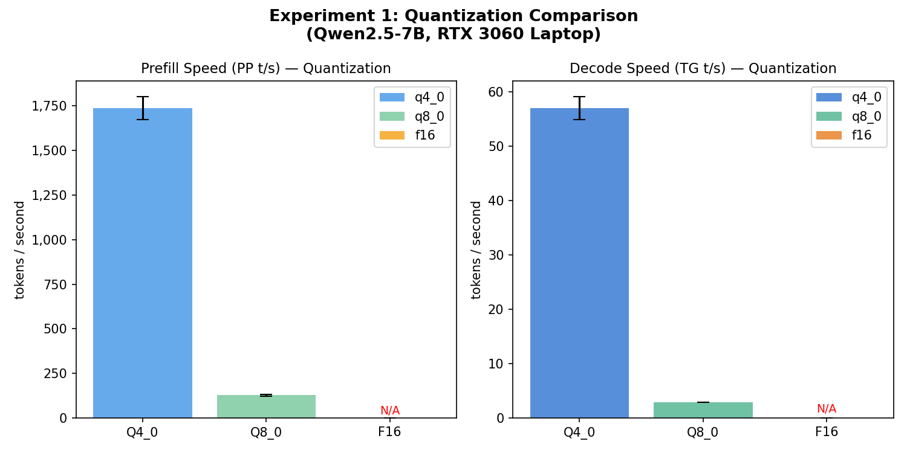
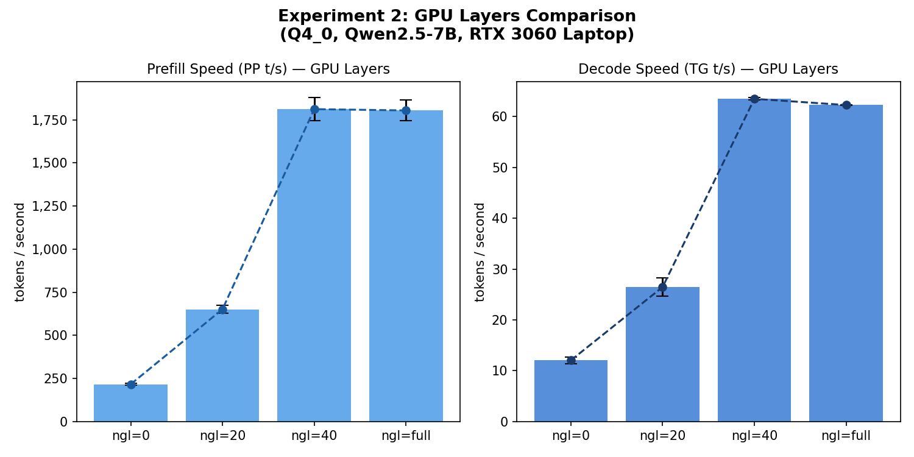
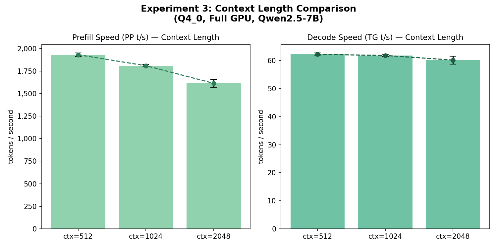

# On-device LLM Inference Optimization

基于 **llama.cpp** 在 Windows + NVIDIA GPU 环境下对 Qwen2.5-7B-Instruct 模型进行端侧推理优化，完成量化对比、GPU 加速、上下文长度三组实验，输出完整 benchmark 数据与分析报告。

---

## 环境要求

| 依赖项 | 版本要求 |
|-------|---------|
| Windows | 10 / 11 (x64) |
| Python | 3.10 及以上 |
| CUDA | 12.x |
| NVIDIA 驱动 | 525+ |
| GPU 显存 | 建议 ≥ 6 GB（Q4_0 最低要求） |

安装 Python 依赖：

```bash
pip install -r requirements.txt
```

---

## 目录结构

```
LLM-Optimizer/
├── analysis/              # T3 分析脚本
│   ├── plot_results.py    # 生成对比图表
│   └── report_gen.py      # 生成 Markdown 分析报告
├── benchmark/
│   ├── experiments/
│   │   ├── exp1_quantization.py   # 量化对比实验
│   │   ├── exp2_gpu_layers.py     # GPU 层数对比实验
│   │   └── exp3_context_len.py    # 上下文长度对比实验
│   └── metrics.py                 # VRAM 采集工具
├── inference/
│   ├── config.py          # 模型路径、benchmark 参数配置
│   └── run_inference.py   # llama-bench 封装（run_bench 函数）
├── llama.cpp/             # llama.cpp 源码（含编译产物）
├── models/                # GGUF 模型文件
├── results/               # JSON 结果 + plots/ 图表
├── setup/
│   ├── build_llama.sh     # 编译 llama.cpp（含 CUDA）
│   ├── download_models.py # 下载模型文件
│   └── verify_install.py  # 验证安装
└── requirements.txt
```

---

## 复现步骤

### Step 1 — 编译 llama.cpp

```bash
bash setup/build_llama.sh
```

编译完成后，`llama.cpp/build/bin/` 目录下应有 `llama-bench.exe`。

### Step 2 — 下载模型

```bash
python setup/download_models.py
```

会下载 Qwen2.5-7B-Instruct 的 Q4_0 / Q8_0 / F16 三个 GGUF 版本到 `models/` 目录。

### Step 3 — 验证安装

```bash
python setup/verify_install.py
```

### Step 4 — 运行三组实验

```bash
# 实验一：量化对比（约 3 分钟）
python -m benchmark.experiments.exp1_quantization --reps 3

# 实验二：GPU 层数对比（约 2 分钟）
python -m benchmark.experiments.exp2_gpu_layers --reps 3 --quant q4_0

# 实验三：上下文长度对比（约 1 分钟）
python -m benchmark.experiments.exp3_context_len --reps 3
```

结果 JSON 自动保存至 `results/` 目录。

### Step 5 — 生成图表和报告

```bash
# 生成对比图表（保存到 results/plots/）
python -m analysis.plot_results

# 生成 Markdown 分析报告（保存为 report.md）
python -m analysis.report_gen
```

---

## 实验结论

以下数据基于 RTX 3060 Laptop（6 GB VRAM）+ Qwen2.5-7B-Instruct + llama.cpp CUDA 后端实测。

### 实验一：量化精度对比

Q4_0 是 6 GB 显存环境下的最佳选择，TG 速度约 57 t/s，用户体验流畅。Q8_0 因体积（约 7.7 GB）超出显存，被迫回落 CPU 计算，TG 速度骤降至约 3 t/s。F16 约 14 GB 无法加载，测试结果为 N/A。



### 实验二：GPU 层数对比

全量 GPU 卸载相比纯 CPU（0 层），TG 速度提升约 5x（12 → 63 t/s）。层数从 0→20→40 呈阶梯式增长，40 层与 full 层结果几乎相同，说明该 7B 模型的计算量主要集中在前 40 个 transformer 层中。



### 实验三：上下文长度对比

上下文从 512 增至 2048，TG 速度仅下降约 3%，非常稳定，说明 llama.cpp 的 KV Cache 机制在当前规模下表现良好。PP 速度下降约 16%，符合 Attention O(n²) 复杂度预期。



### 最佳推理配置

Q4_0 量化 + 全量 GPU 卸载 + 上下文 ≤ 2048，可在 RTX 3060 Laptop 上实现约 57 t/s 的流畅文本生成体验。

---

## 常见问题

**Q: llama-bench.exe 找不到？**
重新执行 `bash setup/build_llama.sh`，确认编译时加了 `-DLLAMA_CUDA=ON`。

**Q: 运行实验时出现 UnicodeDecodeError？**
Windows 下 subprocess 默认 GBK 编码，本项目已在 `run_bench` 中指定 `encoding="utf-8"`，如仍报错请检查 Python 版本（需 ≥ 3.10）。

**Q: Q8_0 / F16 结果都是 N/A？**
显存不足导致的硬件限制，属正常现象。建议使用 Q4_0 或 Q5_K_M 等较小量化版本。
